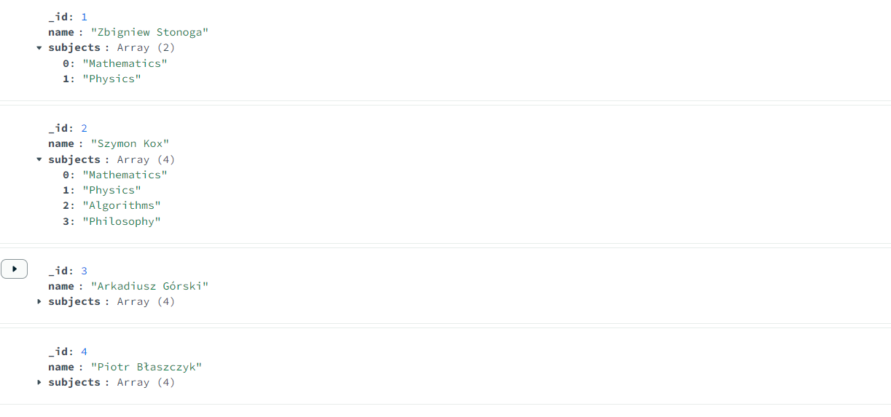
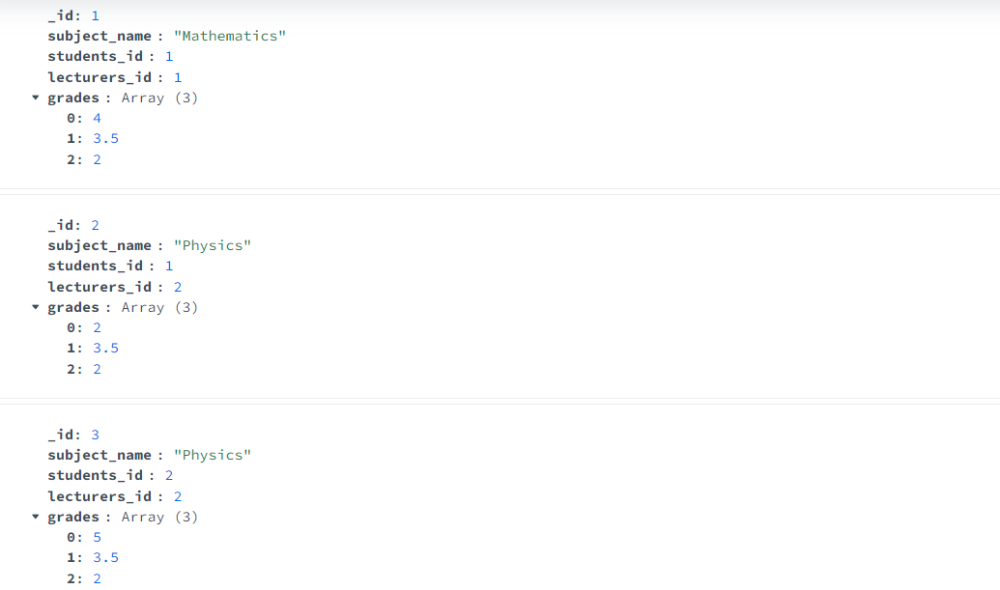
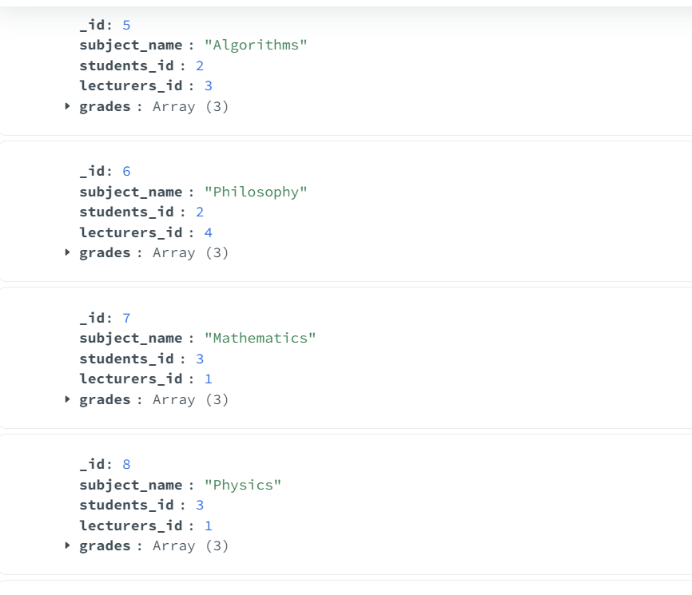
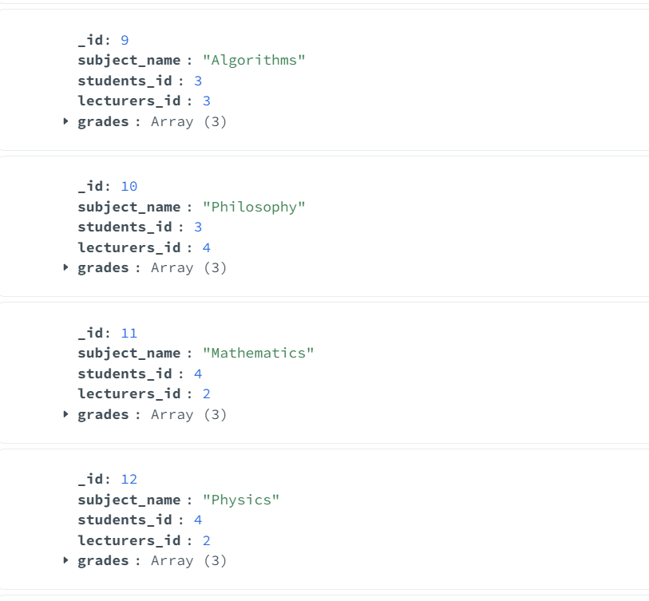
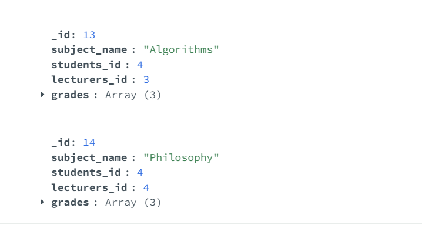

# Dokumentowe bazy danych – MongoDB

ćwiczenie 2


---

**Imiona i nazwiska autorów:**
Krzysztof Swędzioł, Piotr Błaszczyk
--- 


## Yelp Dataset

- [www.yelp.com](http://www.yelp.com) - serwis społecznościowy – informacje o miejscach/lokalach
- restauracje, kluby, hotele itd. `businesses`,
- użytkownicy odwiedzają te miejsca - "meldują się"  `check-in`
- użytkownicy piszą recenzje `reviews` o miejscach/lokalach i wystawiają oceny oceny,
- przykładowy zbiór danych zawiera dane z 5 miast: Phoenix, Las Vegas, Madison, Waterloo i Edinburgh.

# Zadanie 1 - operacje wyszukiwania danych

Dla zbioru Yelp wykonaj następujące zapytania

W niektórych przypadkach może być potrzebne wykorzystanie mechanizmu Aggregation Pipeline

[https://www.mongodb.com/docs/manual/core/aggregation-pipeline/](https://www.mongodb.com/docs/manual/core/aggregation-pipeline/)


1. Zwróć dane wszystkich restauracji (kolekcja `business`, pole `categories` musi zawierać wartość "Restaurants"), które są otwarte w poniedziałki (pole hours) i mają ocenę co najmniej 4 gwiazdki (pole `stars`).  Zapytanie powinno zwracać: nazwę firmy, adres, kategorię, godziny otwarcia i gwiazdki. Posortuj wynik wg nazwy firmy.

 // Sortuje wyniki alfabetycznie po nazwie firmy

2. Ile każda firma otrzymała ocen/wskazówek (kolekcja `tip` ) w 2012. Wynik powinien zawierać nazwę firmy oraz liczbę ocen/wskazówek Wynik posortuj według liczby ocen (`tip`).


3. Recenzje mogą być oceniane przez innych użytkowników jako `cool`, `funny` lub `useful` (kolekcja `review`, pole `votes`, jedna recenzja może mieć kilka głosów w każdej kategorii).  Napisz zapytanie, które zwraca dla każdej z tych kategorii, ile sumarycznie recenzji zostało oznaczonych przez te kategorie (np. recenzja ma kategorię `funny` jeśli co najmniej jedna osoba zagłosowała w ten sposób na daną recenzję)


4. Zwróć dane wszystkich użytkowników (kolekcja `user`), którzy nie mają ani jednego pozytywnego głosu (pole `votes`) z kategorii (`funny` lub `useful`), wynik posortuj alfabetycznie według nazwy użytkownika.


5. Wyznacz, jaką średnia ocenę uzyskała każda firma na podstawie wszystkich recenzji (kolekcja `review`, pole `stars`). Ogranicz do firm, które uzyskały średnią powyżej 3 gwiazdek.

	a) Wynik powinien zawierać id firmy oraz średnią ocenę. Posortuj wynik wg id firmy.

	b) Wynik powinien zawierać nazwę firmy oraz średnią ocenę. Posortuj wynik wg nazwy firmy.

	


## Zadanie 1  - rozwiązanie

> Wyniki: 
> 
> przykłady, kod, zrzuty ekranów, komentarz ...

Na screenshotach będą przedstawione jedne przykładowe wycinki wyników ponieważ jest ich za dużo aby wszystko objąć na zrzutach ekranu. Pozostałe wyniki również spełniają warunki tak samo jak te ze screenshotów.

zadanie 1 : 
db.business.find(
    {
        'categories': {'$in': ['Restaurants']}, 
        'hours.Monday': {'$exists': true}, 
        'stars': {'$gte': 4} 
    },
    {
        'name': 1, 
        'address': 1, 
        'categories': 1, 
        'hours': 1, 
        'stars': 1 
    }
).sort({'name': 1});


zadanie 2 : 

db.tip.aggregate([
    {
        $match: {
            date: { $regex: '^2012' }  
        }
    },
    {
        $group: {
            _id: "$business_id",  
            tip_count: { $sum: 1 }  
        }
    },
    {
        $sort: {
            tip_count: -1  
        }
    }
]);


zadanie 3 : 

db.review.aggregate([
    {
        $group: {
            _id: null, 
            total_cool: { $sum: "$votes.cool" },  
            total_funny: { $sum: "$votes.funny" },  
            total_useful: { $sum: "$votes.useful" }  
        }
    }
]);


zadanie 4 : 
db.users.aggregate([
    {
        $match: {
            $or: [
                { 'votes.funny': { $exists: false } },
                { 'votes.funny': 0 },
                { 'votes.useful': { $exists: false } },
                { 'votes.useful': 0 }
            ]
        }
    },
    {
        $sort: { 'name': 1 } 
    }
]);

zadanie 5 : 

a) Wynik powinien zawierać id firmy oraz średnią ocenę. Posortuj wynik wg id firmy.

	db.review.aggregate([
    {
        $group: {
            _id: "$business_id",  
            averageRating: { $avg: "$stars" }  
        }
    },
    {
        $match: {
            averageRating: { $gt: 3 }  
        }
    },
    {
        $sort: { _id: 1 }  
    }
]);


	b) Wynik powinien zawierać nazwę firmy oraz średnią ocenę. Posortuj wynik wg nazwy firmy.

	db.review.aggregate([
    {
        $group: {
            _id: "$business_id",  
            averageRating: { $avg: "$stars" }  
        }
    },
    {
        $match: {
            averageRating: { $gt: 3 }  
        }
    },
    {
        $lookup: {
            from: "business",  
            localField: "_id",  
            foreignField: "business_id",  
            as: "businessInfo"  
        }
    },
    {
        $unwind: "$businessInfo"  
    },
    {
        $sort: { "businessInfo.name": 1 }  
    },
    {
        $project: {
            _id: 0, 
            businessName: "$businessInfo.name",  
            averageRating: 1 
        }
    }
]);


```js
--  ...
```

# Zadanie 2 - modelowanie danych


Zaproponuj strukturę bazy danych dla wybranego/przykładowego zagadnienia/problemu

Należy wybrać jedno zagadnienie/problem (A lub B)

Przykład A
- Wykładowcy, przedmioty, studenci, oceny
	- Wykładowcy prowadzą zajęcia z poszczególnych przedmiotów
	- Studenci uczęszczają na zajęcia
	- Wykładowcy wystawiają oceny studentom
	- Studenci oceniają zajęcia

Przykład B
- Firmy, wycieczki, osoby
	- Firmy organizują wycieczki
	- Osoby rezerwują miejsca/wykupują bilety
	- Osoby oceniają wycieczki

a) Warto zaproponować/rozważyć różne warianty struktury bazy danych i dokumentów w poszczególnych kolekcjach oraz przeprowadzić dyskusję każdego wariantu (wskazać wady i zalety każdego z wariantów)

b) Kolekcje należy wypełnić przykładowymi danymi

c) W kontekście zaprezentowania wad/zalet należy zaprezentować kilka przykładów/zapytań/zadań/operacji oraz dla których dedykowany jest dany wariantów

W sprawozdaniu należy zamieścić przykładowe dokumenty w formacie JSON ( pkt a) i b)), oraz kod zapytań/operacji (pkt c)), wraz z odpowiednim komentarzem opisującym strukturę dokumentów oraz polecenia ilustrujące wykonanie przykładowych operacji na danych

Do sprawozdania należy kompletny zrzut wykonanych/przygotowanych baz danych (taki zrzut można wykonać np. za pomocą poleceń `mongoexport`, `mongdump` …) oraz plik z kodem operacji zapytań (załącznik powinien mieć format zip).


## Zadanie 2  - rozwiązanie

> Wyniki: 
> 
> przykłady, kod, zrzuty ekranów, komentarz ...
Wybraliśmy bazę danych dla uczelni. Nasza struktura prezentuje się następująco : 
-w kolekcji Lecturers przechowujemy wykładowców, każdemu z nich przypisujemy listę przedmiotów jakich naucza,
-w kolekcji Students przechowujemy studentów wraz z listą przedmiotów na jakie uczęszczają,
-w kolekcji grades przechowujemy oceny dla danego przedmiotu i id wykładowcy, który oceny wstawił oraz studenta do którego oceny z danego przedmiotu należą,
-w kolekcji subjects przechowujemy listę wszystkich przedmiotów wraz z wykładowcami a pod wykładowcami opinie studentów wraz z ich id na temat prowadzonych zajęć przez danego wykładowcę.




Innym podejściem mogłoby być stworzenie listy ocen wraz z wykładowcami je wystawiającymi od razu w kolekcji students w odpowiedniej rubryce. Stwierdziliśmy jednak iż użyta przez nas metoda jest bardziej czytelna. 
Analogicznie listę recenzji również można by przypisać od razu do studentów je wystawiających 

Oto zawartosc kolekecji oceny:




W naszej strukturze każdy element można połączyć po id z autorem/wykonawcą tj. oceny ze studentem, recenzję ze studentem, oceny z wystawiającym je wykładowcą.

Przykłady użycia : 
pokaż wszystkie oceny Arkadiusza Górskiego : 
db.Students.aggregate([
    {
        $match: { name: "Arkadiusz Górski" }
    },
    {
        $lookup: {
            from: "Grades",
            localField: "_id",
            foreignField: "students_id",
            as: "student_grades"
        }
    },
    {
        $project: {
            _id: 0,
            name: 1,
            subject: "$student_grades.subject_name",
            grades: "$student_grades.grades"
        }
    }
]);


pokaż wszystkie recenzje o Albercie Einsteinie : 
db.Subjects.aggregate([
    {
        $match: {
            "subject_name": { $exists: true }  
        }
    },
    {
        $project: {
            _id: 0,
            reviews: { $objectToArray: "$lecturers.Albert Einstein.reviews" }
        }
    },
    {
        $unwind: "$reviews"  
    },
    {
        $project: {
            "review_id": "$reviews.v.review_id",
            "students_id": "$reviews.v.students_id",
            "date": "$reviews.v.date",
            "text": "$reviews.v.text"
        }
    }
]);


pokaż wszystkie opinie użytkownika Zbysiu : 
db.Subjects.aggregate([
    {
        $project: {
            "lecturers": { $objectToArray: "$lecturers" } 
        }
    },
    {
        $unwind: "$lecturers" 
    },
    {
        $project: {
            "lecturerName": "$lecturers.k", 
            "reviews": { $objectToArray: "$lecturers.v.reviews" } 
        }
    },
    {
        $unwind: "$reviews" 
    },
    {
        $match: {
            "reviews.k": "Zbysiu" 
        }
    },
    {
        $project: {
            _id: 0,
            lecturerName: 1,
            review: "$reviews.v" 
        }
    }
]);


```js
--  ...
```

---

Punktacja:

|         |     |
| ------- | --- |
| zadanie | pkt |
| 1       | 0,6 |
| 2       | 1,4 |
| razem   | 2   |


